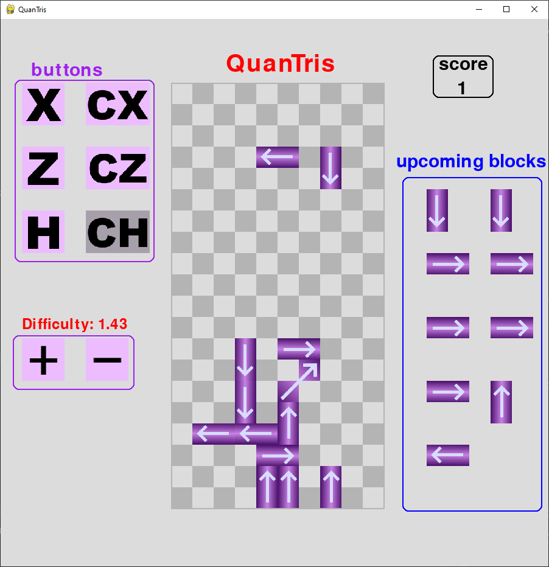

# Quantum Tetris

Developed for MIT IQUHACK 2022 

Group name: Quantris

Group members: `Caspian Chaharom, Danai Bili, Frederik Hardervig, Sneha Shakya, Tomasz Kazulak`

For the MIT iQuHACK Hackathon, the team's task was a 26 hour Microsoft and IonQ joint challenge to use a quantum computer to build a game. Thus the team developed this Quantum Tetris game that introduces quantum concepts, such as destructive interference, through a familiar-inspired game of Tetris.

Awardees of the "Creativity Hack Award" for MIT IQUHACK 2022.

## Game Rules and Goal

Quantim Tetris is designed to teach quantum concepts in a fun and interactive manner. It is inspired by the familiar game of Tetris. 

In this game, your Tetris blocks are "qubits", which look like falling arrow blocks. The aim of the game is to make these blocks disappear by using the idea of "destructive interference". 

The arrow directions seen on the qubit bit blocks in Fig. 2 represent its quantum qubit state. Fig 1. shows the mapping for qubit states to thier corresponding arrow direction. 8 arrow directions were used.  

There are two types of qubit blocks:

* Single qubit blocks:
  * The arrows represent the quantum state of the qubit. The `|0>` basis is the x-axis and the `|1>` basis vector is the y-axis. A Hadamard gate applied to `|0>` mathematically creates `1/√2 (|0>+|1>)`, which would be an arrow pointing in the up-right direction. This arrow direction would be used to add or "destroy" blocks on the game screen.
  * You can use the arrow keys 'x', 'z', and 'h' to control the rotation of the single qubit blocks. This will respectively apply the pauli `x` and `z` gates and Hadamard `h` gates.

* Two qubit blocks:
  * Some blocks have two qubits. The single qubit gates operate to interfere their single qubit counterparts.
  * There are also two two-qubit gates -- the `CX` gate and `CZ` gate. You can activate these gates by pressing the keys `a` and `s`, which are directly above their single qubit counterparts on the keyboard

The goal of the game is to have the blocks disappear using destructive interference. Difficulty of the game can be increased or decreased to speed up or slow down the speed of the falling qubits respectively.

## How to run

Run `python Amalgamation.py` after installing the dependencies `numpy` and `pygame`

## GitHub Repo: https://github.com/CaspianChaharom/Quantum-Tetris

## Pictures
Fig. 1: Mapping to qubit states to arrow direction:

Fig. 2: Screenshot of game during play

## MIT IQUHACK 2022: Our team's experience

After a hectic couple of days of meetings and lots of hacking, we will remember MIT IQUHACK 2022 for the invaluable experience of getting to run Quantum simulations, but also the fantastic opportunity of getting to know so many passionate hackers and scientists. Overall, despite this being the first hackathon for some of us, we were still able to envision, create (and debug) a full project from scratch, which served as an incredible introduction into the field. Of course, this wouldn't have been possible without the tremendous support of the whole community! 
